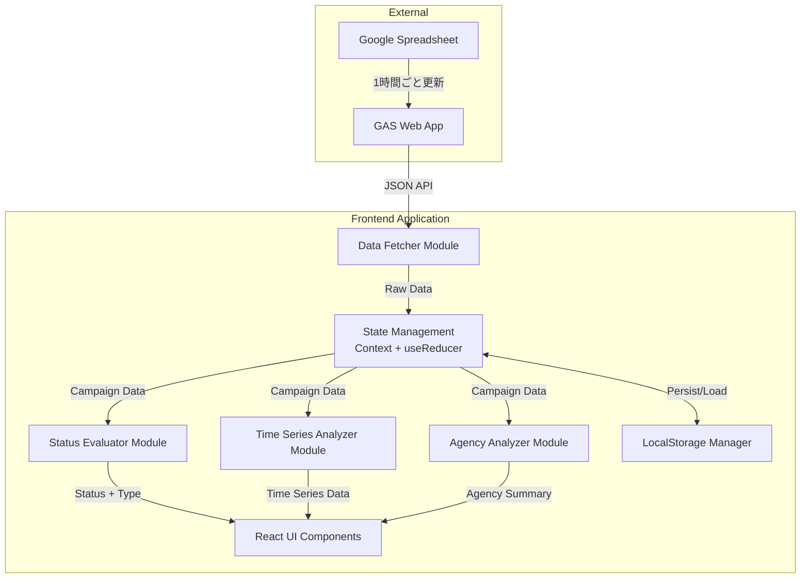

# Design Document

## Overview

VAMキャンペーン監視ダッシュボードは、Googleスプレッドシートから取得したキャンペーンデータをリアルタイムで可視化し、異常検知とトレンド分析を提供するReact + TypeScriptベースのWebアプリケーションです。

### 技術スタック

- **Frontend Framework**: React 18 + TypeScript
- **UI Library**: Tailwind CSS
- **Chart Library**: Recharts
- **Data Fetching**: Google Apps Script Web App (JSON endpoint)
- **State Management**: React Context API + useReducer
- **Data Persistence**: LocalStorage (7日間のデータ保持)
- **Build Tool**: Vite

### 主要機能

1. Googleスプレッドシートからの1時間ごとの自動データ取得
2. キャンペーンステータスの自動判定（要対応/注意/順調）
3. 広告種別の自動分類（予約型/運用型/自社広告）
4. キャンペーン一覧表示（フィルタリング・ソート機能付き）
5. 時系列分析ビュー（過去24時間のimp推移）
6. 代理店別分析ビュー
7. キャンペーン詳細ビュー
8. レスポンシブデザイン（デスクトップ/タブレット/モバイル対応）

## Architecture

### システムアーキテクチャ



### レイヤー構成

1. **Presentation Layer (UI Components)**
   - ビュー: Dashboard, CampaignList, TimeSeriesView, AgencyView, CampaignDetail
   - 共通コンポーネント: Table, Chart, Filter, StatusBadge

2. **Business Logic Layer**
   - Status Evaluator: ステータス判定ロジック
   - Time Series Analyzer: 時系列データ分析
   - Agency Analyzer: 代理店別集計

3. **Data Access Layer**
   - Data Fetcher: API通信
   - LocalStorage Manager: データ永続化

4. **State Management Layer**
   - Context API: グローバル状態管理
   - useReducer: 状態更新ロジック

## Components and Interfaces

### データモデル

#### CampaignData

```typescript
interface CampaignData {
  CAMPAIGN_URL: string;
  ORDER_NAME: string;
  ADVERTISER_NAME: string;
  AGENCY_NAME: string;
  CAMPAIGN_ID: string;
  CAMPAIGN_NAME: string;
  priority: number;
  START_TIME: string; // ISO 8601 format
  END_TIME: string; // ISO 8601 format
  deliveryDays: number;
  targetImp: number;
  cumulativeImp: number;
  dailyImp: number;
  deliveryCap: number;
  todayImp: number;
  totalHours: number;
  elapsedHours: number;
  timeProgressRate: number; // percentage
  impProgress: number;
  progressRate: number; // percentage
}
```

#### CampaignStatus

```typescript
type CampaignStatusType = 
  | 'CRITICAL_BEHIND_80'
  | 'CRITICAL_BEHIND_2_5M'
  | 'CRITICAL_LOW_TODAY'
  | 'CRITICAL_CAP_RISK'
  | 'CRITICAL_ZERO_IMP'
  | 'WARNING_ENDING_SOON'
  | 'WARNING_EARLY_COMPLETE'
  | 'HEALTHY';

interface CampaignStatus {
  type: CampaignStatusType;
  label: string;
  color: 'red' | 'yellow' | 'green';
  icon: string;
}
```

#### AdType

```typescript
type AdType = 'RESERVED' | 'PROGRAMMATIC' | 'HOUSE';

interface AdTypeInfo {
  type: AdType;
  label: string;
}
```

#### EnrichedCampaign

```typescript
interface EnrichedCampaign extends CampaignData {
  status: CampaignStatus;
  adType: AdTypeInfo;
  remainingDays: number;
  remainingImp: number;
}
```

### コアモジュール

#### DataFetcher

```typescript
interface DataFetcherConfig {
  apiEndpoint: string;
  fetchInterval: number; // milliseconds
}

interface FetchResult {
  data: CampaignData[];
  timestamp: Date;
  success: boolean;
  error?: string;
}

class DataFetcher {
  constructor(config: DataFetcherConfig);
  
  // データ取得
  async fetch(): Promise<FetchResult>;
  
  // 自動更新開始
  startAutoFetch(callback: (result: FetchResult) => void): void;
  
  // 自動更新停止
  stopAutoFetch(): void;
}
```

#### StatusEvaluator

```typescript
class StatusEvaluator {
  // ステータス判定
  evaluateStatus(campaign: CampaignData): CampaignStatus;
  
  // 広告種別判定
  evaluateAdType(orderName: string): AdTypeInfo;
  
  // 残り日数計算
  calculateRemainingDays(endTime: string): number;
  
  // 残り必要imp計算
  calculateRemainingImp(targetImp: number, cumulativeImp: number): number;
}
```

#### TimeSeriesAnalyzer

```typescript
interface TimeSeriesDataPoint {
  timestamp: Date;
  totalImp: number;
  reservedImp: number;
  programmaticImp: number;
  houseImp: number;
}

interface TimeSeriesAnalysis {
  dataPoints: TimeSeriesDataPoint[];
  peakHour: number;
  lowHour: number;
  averageImp: number;
}

class TimeSeriesAnalyzer {
  // 時系列データ追加
  addDataPoint(campaigns: EnrichedCampaign[], timestamp: Date): void;
  
  // 過去24時間のデータ取得
  getLast24Hours(): TimeSeriesDataPoint[];
  
  // 分析サマリー生成
  analyze(): TimeSeriesAnalysis;
}
```

#### AgencyAnalyzer

```typescript
interface AgencySummary {
  agencyName: string;
  totalCampaigns: number;
  criticalCount: number;
  warningCount: number;
  healthyCount: number;
  averageProgressRate: number;
  totalImp: number;
}

class AgencyAnalyzer {
  // 代理店別サマリー生成
  analyze(campaigns: EnrichedCampaign[]): AgencySummary[];
  
  // ソート
  sortByCriticalCount(summaries: AgencySummary[]): AgencySummary[];
}
```

#### LocalStorageManager

```typescript
interface StorageData {
  campaigns: EnrichedCampaign[];
  timestamp: Date;
}

class LocalStorageManager {
  // データ保存
  save(data: StorageData): void;
  
  // データ読み込み
  load(): StorageData | null;
  
  // 時系列データ保存
  saveTimeSeries(dataPoint: TimeSeriesDataPoint): void;
  
  // 時系列データ読み込み
  loadTimeSeries(): TimeSeriesDataPoint[];
  
  // 古いデータ削除（7日以上前）
  cleanup(): void;
}
```

### UIコンポーネント

#### Dashboard

```typescript
interface DashboardProps {
  // なし（Context経由でデータ取得）
}

// メインダッシュボードコンポーネント
// タブ切り替え: キャンペーン一覧 / 時系列分析 / 代理店別分析
const Dashboard: React.FC<DashboardProps>;
```

#### CampaignList

```typescript
interface CampaignListProps {
  campaigns: EnrichedCampaign[];
  onCampaignClick: (campaign: EnrichedCampaign) => void;
}

// キャンペーン一覧テーブル
// フィルタリング・ソート機能付き
const CampaignList: React.FC<CampaignListProps>;
```

#### TimeSeriesView

```typescript
interface TimeSeriesViewProps {
  analysis: TimeSeriesAnalysis;
}

// 時系列グラフビュー
// タブ切り替え: 全体 / 予約型 / 運用型 / 自社広告
const TimeSeriesView: React.FC<TimeSeriesViewProps>;
```

#### AgencyView

```typescript
interface AgencyViewProps {
  summaries: AgencySummary[];
}

// 代理店別サマリーテーブル
const AgencyView: React.FC<AgencyViewProps>;
```

#### CampaignDetail

```typescript
interface CampaignDetailProps {
  campaign: EnrichedCampaign;
  onBack: () => void;
}

// キャンペーン詳細ビュー
// ペーシング分析グラフ付き
const CampaignDetail: React.FC<CampaignDetailProps>;
```

## Data Models

### データフロー

1. **初期化時**
   ```
   DataFetcher.fetch() 
   → CampaignData[] 
   → StatusEvaluator.evaluateStatus() 
   → EnrichedCampaign[] 
   → State Management 
   → UI Components
   ```

2. **1時間ごとの更新**
   ```
   DataFetcher.startAutoFetch() 
   → FetchResult 
   → LocalStorageManager.save() 
   → TimeSeriesAnalyzer.addDataPoint() 
   → State Update 
   → UI Re-render
   ```

3. **フィルタリング・ソート**
   ```
   User Action 
   → Filter/Sort Logic (Client-side) 
   → Filtered EnrichedCampaign[] 
   → UI Update
   ```

### 状態管理

```typescript
interface AppState {
  campaigns: EnrichedCampaign[];
  lastFetchTime: Date | null;
  isLoading: boolean;
  error: string | null;
  selectedCampaign: EnrichedCampaign | null;
  filters: {
    status: CampaignStatusType[];
    adType: AdType[];
    agency: string[];
  };
  sortBy: 'name' | 'agency' | 'progressRate';
  sortOrder: 'asc' | 'desc';
}

type AppAction =
  | { type: 'FETCH_START' }
  | { type: 'FETCH_SUCCESS'; payload: { campaigns: EnrichedCampaign[]; timestamp: Date } }
  | { type: 'FETCH_ERROR'; payload: string }
  | { type: 'SELECT_CAMPAIGN'; payload: EnrichedCampaign | null }
  | { type: 'SET_FILTERS'; payload: Partial<AppState['filters']> }
  | { type: 'SET_SORT'; payload: { sortBy: AppState['sortBy']; sortOrder: AppState['sortOrder'] } };

const appReducer = (state: AppState, action: AppAction): AppState => {
  // reducer implementation
};
```


## Correctness Properties

*A property is a characteristic or behavior that should hold true across all valid executions of a system-essentially, a formal statement about what the system should do. Properties serve as the bridge between human-readable specifications and machine-verifiable correctness guarantees.*

### Property 1: データレコード完全性

*For any* キャンペーンデータレコード、そのレコードは20項目のフィールド（CAMPAIGN_URL, ORDER_NAME, ADVERTISER_NAME, AGENCY_NAME, CAMPAIGN_ID, CAMPAIGN_NAME, priority, START_TIME, END_TIME, deliveryDays, targetImp, cumulativeImp, dailyImp, deliveryCap, todayImp, totalHours, elapsedHours, timeProgressRate, impProgress, progressRate）をすべて含んでいる必要がある

**Validates: Requirements 1.2**

### Property 2: 広告種別判定 - 運用型

*For any* ORDER_NAMEに「PMP」が含まれるキャンペーン、そのキャンペーンは「運用型」（PROGRAMMATIC）として分類される必要がある

**Validates: Requirements 2.1**

### Property 3: 広告種別判定 - 自社広告

*For any* ORDER_NAMEに「自社広告」が含まれるキャンペーン、そのキャンペーンは「自社広告」（HOUSE）として分類される必要がある

**Validates: Requirements 2.2**

### Property 4: 広告種別判定 - 予約型

*For any* ORDER_NAMEに「PMP」も「自社広告」も含まれないキャンペーン、そのキャンペーンは「予約型」（RESERVED）として分類される必要がある

**Validates: Requirements 2.3**

### Property 5: ステータス判定 - ビハインド80%未満

*For any* 経過時間が24時間以上かつ進捗率が80%以下のキャンペーン、そのキャンペーンは「🔴要対応（ビハインド80%未満）」（CRITICAL_BEHIND_80）として判定される必要がある

**Validates: Requirements 3.1**

### Property 6: ステータス判定 - ビハインド250万imp以上

*For any* 目標Impが2500000以上かつ経過時間が24時間以上かつ進捗率が100%未満のキャンペーン、そのキャンペーンは「🔴要対応（ビハインド250万imp以上）」（CRITICAL_BEHIND_2_5M）として判定される必要がある

**Validates: Requirements 3.2**

### Property 7: ステータス判定 - 当日imp少なめ

*For any* 日割りImpが0より大きくかつ当日Impが日割りImpの10%未満のキャンペーン、そのキャンペーンは「🔴要対応（当日imp少なめ）」（CRITICAL_LOW_TODAY）として判定される必要がある

**Validates: Requirements 3.3**

### Property 8: ステータス判定 - キャップ未達リスク

*For any* 残り日数が0より大きくかつ配信キャップ×残り日数が残り必要impを下回るキャンペーン、そのキャンペーンは「🔴要対応（キャップ未達リスク）」（CRITICAL_CAP_RISK）として判定される必要がある

**Validates: Requirements 3.4**

### Property 9: ステータス判定 - 0imp異常

*For any* 目標Impが0より大きくかつ当日Impが0のキャンペーン、そのキャンペーンは「🔴要対応（0imp異常）」（CRITICAL_ZERO_IMP）として判定される必要がある

**Validates: Requirements 3.5**

### Property 10: ステータス判定の優先順位

*For any* 複数のステータス条件に該当するキャンペーン、要対応条件（3.1→3.2→3.3→3.4→3.5の順）が最優先で評価され、次に注意条件が評価され、最初に該当した条件でステータスが決定される必要がある

**Validates: Requirements 3.6, 4.3**

### Property 11: ステータス判定 - 1週間以内終了

*For any* 要対応条件に該当せずかつ終了日時が7日以内かつ進捗率が100%未満のキャンペーン、そのキャンペーンは「🟡注意（1週間以内終了）」（WARNING_ENDING_SOON）として判定される必要がある

**Validates: Requirements 4.1**

### Property 12: ステータス判定 - 早期終了・超過

*For any* 要対応条件に該当せずかつ累積実績Impが目標Imp以上のキャンペーン、そのキャンペーンは「🟡注意（早期終了・超過）」（WARNING_EARLY_COMPLETE）として判定される必要がある

**Validates: Requirements 4.2**

### Property 13: ステータス判定 - 順調

*For any* 要対応条件にも注意条件にも該当しないキャンペーン、そのキャンペーンは「🟢順調」（HEALTHY）として判定される必要がある

**Validates: Requirements 5.1**

### Property 14: フィルタリング機能

*For any* キャンペーンリストとフィルタ条件（ステータス、広告種別、代理店名）、フィルタリング後のリストはすべての条件を満たすキャンペーンのみを含む必要がある

**Validates: Requirements 6.3, 6.4, 6.5**

### Property 15: ソート機能

*For any* キャンペーンリストとソート条件（キャンペーン名、代理店名、進捗率）、ソート後のリストは指定された条件で昇順または降順に正しく並べられている必要がある

**Validates: Requirements 6.6**

### Property 16: 時系列分析 - ピーク時間検出

*For any* 過去24時間の時系列データ、ピーク時間は最大impを記録した時間であり、低調な時間は最小impを記録した時間である必要がある

**Validates: Requirements 7.3**

### Property 17: 代理店別集計

*For any* キャンペーンリスト、代理店別サマリーは各代理店の稼働キャンペーン数、要対応キャンペーン数、注意キャンペーン数、平均進捗率、総impを正しく集計している必要がある

**Validates: Requirements 8.1, 8.2, 8.3, 8.4, 8.5**

### Property 18: 代理店別ソート

*For any* 代理店サマリーリスト、要対応キャンペーン数でソートした場合、リストは要対応キャンペーン数の降順に正しく並べられている必要がある

**Validates: Requirements 8.7**

### Property 19: 大量データ処理

*For any* 1000件以上のキャンペーンデータ、システムはすべてのデータを正常に処理し、ステータス判定、フィルタリング、ソート、集計機能が正しく動作する必要がある

**Validates: Requirements 10.4**

### Property 20: データ永続化ラウンドトリップ

*For any* キャンペーンデータ、LocalStorageに保存してから読み込んだデータは元のデータと同等である必要がある

**Validates: Requirements 12.1**

### Property 21: データ保持期間管理

*For any* 保存されたデータ、7日以内のデータは保持され、7日以上経過したデータは自動的に削除される必要がある

**Validates: Requirements 12.2, 12.3**

### Property 22: 期間指定データ取得

*For any* 指定された期間、その期間内に保存されたすべてのデータが正しく取得できる必要がある

**Validates: Requirements 12.4**

### Property 23: ペーシング状態判定

*For any* キャンペーン、時間進捗率が進捗率を上回る場合はビハインド状態、進捗率が時間進捗率を上回る場合は順調または先行状態として正しく判定される必要がある

**Validates: Requirements 13.6, 13.7**


## Error Handling

### エラー分類

1. **ネットワークエラー**
   - 原因: インターネット接続の問題、APIエンドポイントの到達不可
   - 対応: ユーザーにネットワーク接続確認を促すメッセージを表示
   - リトライ: 自動リトライ（指数バックオフ: 5秒、10秒、20秒）

2. **APIエラー**
   - 原因: GAS Web Appのエラー、認証エラー、レート制限
   - 対応: エラー内容と再試行ボタンを表示
   - リトライ: ユーザーによる手動リトライ

3. **データ形式エラー**
   - 原因: 期待されるフィールドの欠落、型の不一致
   - 対応: データ形式エラーメッセージを表示、管理者に通知（console.error）
   - リトライ: 自動リトライせず、前回成功時のデータを保持

4. **LocalStorageエラー**
   - 原因: ストレージ容量不足、ブラウザ設定による無効化
   - 対応: 警告メッセージを表示、メモリ内でのみ動作継続
   - リトライ: なし

### エラーハンドリング戦略

```typescript
interface ErrorState {
  type: 'network' | 'api' | 'data_format' | 'storage' | null;
  message: string;
  timestamp: Date;
  retryCount: number;
}

// エラーハンドリングの実装例
const handleFetchError = (error: Error, retryCount: number): ErrorState => {
  if (error instanceof NetworkError) {
    return {
      type: 'network',
      message: 'ネットワーク接続を確認してください',
      timestamp: new Date(),
      retryCount
    };
  }
  
  if (error instanceof APIError) {
    return {
      type: 'api',
      message: `APIエラー: ${error.message}`,
      timestamp: new Date(),
      retryCount
    };
  }
  
  if (error instanceof DataFormatError) {
    return {
      type: 'data_format',
      message: 'データ形式が不正です。管理者に連絡してください',
      timestamp: new Date(),
      retryCount
    };
  }
  
  return {
    type: null,
    message: '不明なエラーが発生しました',
    timestamp: new Date(),
    retryCount
  };
};
```

### フォールバック戦略

1. **データ取得失敗時**
   - 前回取得成功時のデータを表示し続ける
   - 画面上部にエラーバナーを表示
   - 最終取得成功時刻を表示

2. **LocalStorage利用不可時**
   - メモリ内でのみデータを保持
   - ページリロード時にデータが失われることを警告

3. **部分的なデータ欠損時**
   - 有効なレコードのみを表示
   - 無効なレコード数を警告として表示

## Testing Strategy

### テスト方針

本プロジェクトでは、ユニットテストとプロパティベーステストの両方を使用して包括的なテストカバレッジを実現します。

- **ユニットテスト**: 特定の例、エッジケース、エラー条件を検証
- **プロパティベーステスト**: すべての入力に対して成立すべき普遍的な特性を検証

### テストライブラリ

- **テストフレームワーク**: Vitest
- **プロパティベーステストライブラリ**: fast-check
- **UIテスト**: React Testing Library
- **カバレッジ**: 80%以上を目標

### プロパティベーステスト設定

各プロパティテストは最低100回の反復実行を行い、設計ドキュメントのプロパティを参照するタグを含める必要があります。

タグ形式: `Feature: vam-campaign-monitoring-dashboard, Property {number}: {property_text}`

### テストカテゴリ

#### 1. ビジネスロジックテスト

**ユニットテスト**:
- 特定のORDER_NAMEパターンでの広告種別判定
- 境界値でのステータス判定（進捗率80%、24時間、7日など）
- エラー条件での動作確認

**プロパティベーステスト**:
- Property 2-4: 広告種別判定（任意のORDER_NAMEに対して）
- Property 5-13: ステータス判定（任意のキャンペーンデータに対して）
- Property 10: ステータス判定の優先順位（複数条件に該当するデータに対して）

#### 2. データ処理テスト

**ユニットテスト**:
- 正常なデータ構造の検証
- 欠損フィールドの検出
- 型変換エラーの処理

**プロパティベーステスト**:
- Property 1: データレコード完全性（任意のレコードに対して）
- Property 19: 大量データ処理（1000件以上のデータに対して）
- Property 20: データ永続化ラウンドトリップ（任意のデータに対して）

#### 3. UI機能テスト

**ユニットテスト**:
- 特定のフィルタ条件での結果確認
- 特定のソート条件での結果確認
- ユーザーインタラクション（クリック、入力）の動作確認

**プロパティベーステスト**:
- Property 14: フィルタリング機能（任意のフィルタ条件に対して）
- Property 15: ソート機能（任意のソート条件に対して）

#### 4. 分析機能テスト

**ユニットテスト**:
- 特定の時系列データでのピーク時間検出
- 特定の代理店データでの集計結果確認

**プロパティベーステスト**:
- Property 16: 時系列分析（任意の時系列データに対して）
- Property 17: 代理店別集計（任意のキャンペーンリストに対して）
- Property 18: 代理店別ソート（任意の代理店サマリーに対して）
- Property 23: ペーシング状態判定（任意のキャンペーンに対して）

#### 5. データ永続化テスト

**ユニットテスト**:
- LocalStorageへの保存・読み込み
- ストレージ容量不足時の動作
- 不正なデータ形式の処理

**プロパティベーステスト**:
- Property 20: データ永続化ラウンドトリップ（任意のデータに対して）
- Property 21: データ保持期間管理（任意の日付に対して）
- Property 22: 期間指定データ取得（任意の期間に対して）

### テスト実装例

#### プロパティベーステストの例

```typescript
import { describe, it, expect } from 'vitest';
import fc from 'fast-check';
import { StatusEvaluator } from './StatusEvaluator';

describe('StatusEvaluator', () => {
  // Feature: vam-campaign-monitoring-dashboard, Property 2: 広告種別判定 - 運用型
  it('should classify campaigns with "PMP" in ORDER_NAME as PROGRAMMATIC', () => {
    fc.assert(
      fc.property(
        fc.string(), // prefix
        fc.string(), // suffix
        (prefix, suffix) => {
          const orderName = `${prefix}PMP${suffix}`;
          const evaluator = new StatusEvaluator();
          const result = evaluator.evaluateAdType(orderName);
          expect(result.type).toBe('PROGRAMMATIC');
        }
      ),
      { numRuns: 100 }
    );
  });

  // Feature: vam-campaign-monitoring-dashboard, Property 5: ステータス判定 - ビハインド80%未満
  it('should mark campaigns as CRITICAL_BEHIND_80 when elapsed >= 24h and progress <= 80%', () => {
    fc.assert(
      fc.property(
        fc.integer({ min: 24, max: 1000 }), // elapsedHours
        fc.float({ min: 0, max: 80 }), // progressRate
        fc.record({
          CAMPAIGN_URL: fc.string(),
          ORDER_NAME: fc.string(),
          ADVERTISER_NAME: fc.string(),
          AGENCY_NAME: fc.string(),
          CAMPAIGN_ID: fc.string(),
          CAMPAIGN_NAME: fc.string(),
          priority: fc.integer(),
          START_TIME: fc.date().map(d => d.toISOString()),
          END_TIME: fc.date().map(d => d.toISOString()),
          deliveryDays: fc.integer({ min: 1 }),
          targetImp: fc.integer({ min: 1 }),
          cumulativeImp: fc.integer({ min: 0 }),
          dailyImp: fc.integer({ min: 0 }),
          deliveryCap: fc.integer({ min: 0 }),
          todayImp: fc.integer({ min: 0 }),
          totalHours: fc.integer({ min: 1 }),
        }),
        (elapsedHours, progressRate, baseData) => {
          const campaign = {
            ...baseData,
            elapsedHours,
            progressRate,
            timeProgressRate: 50,
            impProgress: 0,
          };
          const evaluator = new StatusEvaluator();
          const result = evaluator.evaluateStatus(campaign);
          expect(result.type).toBe('CRITICAL_BEHIND_80');
        }
      ),
      { numRuns: 100 }
    );
  });
});
```

#### ユニットテストの例

```typescript
describe('StatusEvaluator - Edge Cases', () => {
  it('should handle exactly 24 hours elapsed', () => {
    const campaign = createMockCampaign({
      elapsedHours: 24,
      progressRate: 80,
    });
    const evaluator = new StatusEvaluator();
    const result = evaluator.evaluateStatus(campaign);
    expect(result.type).toBe('CRITICAL_BEHIND_80');
  });

  it('should handle exactly 80% progress rate', () => {
    const campaign = createMockCampaign({
      elapsedHours: 25,
      progressRate: 80,
    });
    const evaluator = new StatusEvaluator();
    const result = evaluator.evaluateStatus(campaign);
    expect(result.type).toBe('CRITICAL_BEHIND_80');
  });

  it('should handle network error gracefully', async () => {
    const fetcher = new DataFetcher({ apiEndpoint: 'invalid-url', fetchInterval: 3600000 });
    const result = await fetcher.fetch();
    expect(result.success).toBe(false);
    expect(result.error).toBeDefined();
  });
});
```

### テスト実行

```bash
# すべてのテスト実行
npm run test

# プロパティベーステストのみ実行
npm run test -- --grep "Property"

# カバレッジレポート生成
npm run test:coverage
```

### CI/CD統合

- すべてのプルリクエストでテストを自動実行
- カバレッジが80%未満の場合はビルド失敗
- プロパティベーステストの失敗時は反例を記録

