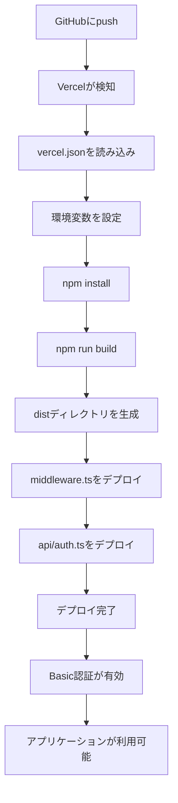

# デプロイ関連ファイル一覧

このドキュメントでは、Vercelデプロイに関連するすべてのファイルとその役割を説明します。

## 設定ファイル

### vercel.json

**場所**: プロジェクトルート

**役割**: Vercelのビルドとデプロイの設定

**内容**:
- ビルドコマンド: `npm run build`
- 出力ディレクトリ: `dist`
- フレームワーク: Vite
- ルーティング設定: すべてのリクエストを`index.html`にリダイレクト（SPA対応）
- セキュリティヘッダー: `X-Content-Type-Options`, `X-Frame-Options`, `X-XSS-Protection`, `Referrer-Policy`
- 環境変数の参照設定

**重要度**: 🔴 必須

### .vercelignore

**場所**: プロジェクトルート

**役割**: Vercelにアップロードしないファイルを指定

**内容**:
- `node_modules`: 依存関係（Vercelが自動インストール）
- テストファイル: `*.test.ts`, `*.test.tsx`, `coverage`
- 環境変数ファイル: `.env`, `.env.local`
- IDE設定: `.vscode`, `.idea`
- ログファイル: `*.log`
- その他: `.DS_Store`, `.kiro`

**重要度**: 🟡 推奨

### .env.example

**場所**: プロジェクトルート

**役割**: 必要な環境変数のテンプレート

**内容**:
- `VITE_GOOGLE_CLIENT_ID`: Google OAuth 2.0クライアントID
- `VITE_SPREADSHEET_ID`: GoogleスプレッドシートID
- `VITE_SHEET_NAME`: シート名
- `BASIC_AUTH_USER`: Basic認証のユーザー名
- `BASIC_AUTH_PASSWORD`: Basic認証のパスワード

**重要度**: 🟢 参考

## 認証関連ファイル

### middleware.ts

**場所**: プロジェクトルート

**役割**: Vercel Edge MiddlewareでBasic認証を実装

**動作**:
1. すべてのリクエストをインターセプト
2. `Authorization`ヘッダーをチェック
3. ユーザー名とパスワードを検証
4. 認証成功: リクエストを続行
5. 認証失敗: 401エラーとBasic認証ダイアログを表示

**環境変数**:
- `BASIC_AUTH_USER`: 認証に使用するユーザー名
- `BASIC_AUTH_PASSWORD`: 認証に使用するパスワード

**重要度**: 🔴 必須（Basic認証を使用する場合）

**注意**: 
- Next.jsの型を使用していますが、Vercelが自動的に提供します
- ローカルビルドには含まれません（`tsconfig.json`で除外）

### api/auth.ts

**場所**: `api/auth.ts`

**役割**: Vercel Serverless FunctionでBasic認証APIを提供

**動作**:
1. `/api/auth`エンドポイントを提供
2. `Authorization`ヘッダーをチェック
3. 認証結果をJSONで返す

**環境変数**:
- `BASIC_AUTH_USER`: 認証に使用するユーザー名
- `BASIC_AUTH_PASSWORD`: 認証に使用するパスワード

**重要度**: 🟡 オプション（middleware.tsで十分）

**注意**: 
- `@vercel/node`の型を使用
- ローカルビルドには含まれません

## ドキュメントファイル

### VERCEL_DEPLOYMENT.md

**場所**: プロジェクトルート

**役割**: 詳細なデプロイ手順とトラブルシューティング

**内容**:
- デプロイ手順（ステップバイステップ）
- 環境変数の設定方法
- Google OAuth 2.0の設定更新
- 自動デプロイの設定
- トラブルシューティング
- カスタムドメインの設定
- セキュリティのベストプラクティス

**重要度**: 🟢 参考

### QUICK_DEPLOY.md

**場所**: プロジェクトルート

**役割**: 5分でデプロイするための簡易ガイド

**内容**:
- 最小限の手順でデプロイ
- よくある質問
- 次のステップ

**重要度**: 🟢 参考

### DEPLOYMENT_CHECKLIST.md

**場所**: プロジェクトルート

**役割**: デプロイ前後の確認項目チェックリスト

**内容**:
- デプロイ前の確認
- Vercelプロジェクトの設定
- Google Cloud Consoleの設定
- デプロイ後の確認
- セキュリティの確認
- 自動デプロイの確認
- トラブルシューティング

**重要度**: 🟢 参考

### DEPLOYMENT_FILES.md（このファイル）

**場所**: プロジェクトルート

**役割**: デプロイ関連ファイルの一覧と説明

**重要度**: 🟢 参考

## ファイル構成図

```
vam-campaign-dashboard/
├── vercel.json                 # Vercel設定（必須）
├── .vercelignore              # アップロード除外ファイル（推奨）
├── .env.example               # 環境変数テンプレート（参考）
├── middleware.ts              # Basic認証（必須）
├── api/
│   └── auth.ts               # 認証API（オプション）
├── VERCEL_DEPLOYMENT.md       # 詳細デプロイガイド（参考）
├── QUICK_DEPLOY.md            # 簡易デプロイガイド（参考）
├── DEPLOYMENT_CHECKLIST.md    # チェックリスト（参考）
└── DEPLOYMENT_FILES.md        # このファイル（参考）
```

## デプロイフロー



## 環境変数の管理

### 開発環境（ローカル）

- ファイル: `.env`（Gitにコミットしない）
- 参照: `.env.example`をコピーして作成

### 本番環境（Vercel）

- 設定場所: Vercel Dashboard > プロジェクト > Settings > Environment Variables
- 環境: Production, Preview, Development
- 必須変数:
  - `VITE_GOOGLE_CLIENT_ID`
  - `VITE_SPREADSHEET_ID`
  - `VITE_SHEET_NAME`
  - `BASIC_AUTH_USER`
  - `BASIC_AUTH_PASSWORD`

## セキュリティ考慮事項

### Basic認証

- **強力なパスワード**: 最低12文字、英数字と記号を含む
- **環境変数で管理**: コードにハードコードしない
- **定期的な変更**: パスワードを定期的に変更

### 環境変数

- **Gitにコミットしない**: `.env`は`.gitignore`に含まれている
- **Vercel Dashboardで管理**: 環境変数はVercel Dashboardでのみ設定
- **最小権限の原則**: 必要な環境変数のみを設定

### セキュリティヘッダー

- `X-Content-Type-Options: nosniff`: MIMEタイプスニッフィングを防止
- `X-Frame-Options: DENY`: クリックジャッキングを防止
- `X-XSS-Protection: 1; mode=block`: XSS攻撃を防止
- `Referrer-Policy: strict-origin-when-cross-origin`: リファラー情報の漏洩を防止

## トラブルシューティング

### ビルドエラー

**症状**: Vercelのビルドが失敗する

**確認項目**:
1. ローカルで`npm run build`が成功するか
2. `package.json`の依存関係が正しいか
3. `vercel.json`の設定が正しいか
4. 環境変数が設定されているか

### Basic認証が機能しない

**症状**: Basic認証のダイアログが表示されない

**確認項目**:
1. `middleware.ts`がプロジェクトルートに存在するか
2. `BASIC_AUTH_USER`と`BASIC_AUTH_PASSWORD`が環境変数に設定されているか
3. Vercelのログにエラーがないか
4. Vercel Edge Middlewareが有効になっているか

### 環境変数が読み込まれない

**症状**: アプリケーションが環境変数を読み込めない

**確認項目**:
1. 環境変数名が`VITE_`プレフィックスで始まっているか（クライアント側で使用する場合）
2. Vercel Dashboardで環境変数が設定されているか
3. デプロイを再実行したか（環境変数の変更後は再デプロイが必要）

## 参考リンク

- [Vercel Documentation](https://vercel.com/docs)
- [Vite Deployment Guide](https://vitejs.dev/guide/static-deploy.html#vercel)
- [Vercel Edge Middleware](https://vercel.com/docs/concepts/functions/edge-middleware)
- [Vercel Serverless Functions](https://vercel.com/docs/concepts/functions/serverless-functions)
- [Vercel Environment Variables](https://vercel.com/docs/concepts/projects/environment-variables)
