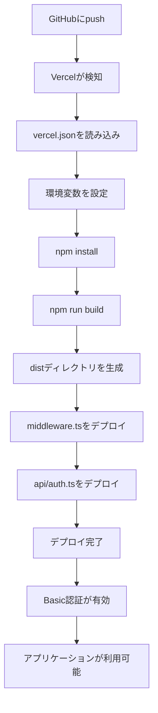

# Task 18: Vercelデプロイ設定 - 完了サマリー

## 実装概要

Task 18「Vercelデプロイ設定」を完了しました。このタスクでは、VAMキャンペーン監視ダッシュボードをVercelにデプロイするための設定とドキュメントを作成しました。

## 実装内容

### 18.1 vercel.jsonの作成 ✅

**ファイル**: `vercel.json`

**内容**:
- ビルドコマンド: `npm run build`
- 出力ディレクトリ: `dist`
- フレームワーク: Vite
- ルーティング設定: SPA対応（すべてのリクエストを`index.html`にリダイレクト）
- セキュリティヘッダー:
  - `X-Content-Type-Options: nosniff`
  - `X-Frame-Options: DENY`
  - `X-XSS-Protection: 1; mode=block`
  - `Referrer-Policy: strict-origin-when-cross-origin`
- 環境変数の参照設定

### 18.2 環境変数の設定 ✅

**ファイル**: `.env.example`（更新）

**追加した環境変数**:
- `BASIC_AUTH_USER`: Basic認証のユーザー名
- `BASIC_AUTH_PASSWORD`: Basic認証のパスワード

**既存の環境変数**:
- `VITE_GOOGLE_CLIENT_ID`: Google OAuth 2.0クライアントID
- `VITE_SPREADSHEET_ID`: GoogleスプレッドシートID
- `VITE_SHEET_NAME`: シート名

**Vercelでの設定方法**:
- Vercel Dashboard > プロジェクト > Settings > Environment Variables
- すべての環境（Production, Preview, Development）に設定

### 18.3 Basic認証の設定 ✅

#### middleware.ts

**ファイル**: `middleware.ts`

**役割**: Vercel Edge Middlewareを使用してBasic認証を実装

**動作**:
1. すべてのリクエストをインターセプト
2. `Authorization`ヘッダーをチェック
3. ユーザー名とパスワードを検証
4. 認証成功: リクエストを続行
5. 認証失敗: 401エラーとBasic認証ダイアログを表示

**環境変数**:
- `BASIC_AUTH_USER`: 認証に使用するユーザー名
- `BASIC_AUTH_PASSWORD`: 認証に使用するパスワード

#### api/auth.ts

**ファイル**: `api/auth.ts`

**役割**: Vercel Serverless FunctionでBasic認証APIを提供（オプション）

**動作**:
1. `/api/auth`エンドポイントを提供
2. `Authorization`ヘッダーをチェック
3. 認証結果をJSONで返す

#### その他の設定

- **tsconfig.json**: `middleware.ts`と`api`ディレクトリをビルドから除外
- **.vercelignore**: 不要なファイルをVercelにアップロードしないように設定
- **package.json**: `@vercel/node`を開発依存関係に追加

### 18.4 GitHubとVercelの連携 ✅

**ドキュメント作成**:

1. **VERCEL_DEPLOYMENT.md**: 詳細なデプロイ手順とトラブルシューティング
   - デプロイ手順（ステップバイステップ）
   - 環境変数の設定方法
   - Google OAuth 2.0の設定更新
   - 自動デプロイの設定
   - トラブルシューティング
   - カスタムドメインの設定
   - セキュリティのベストプラクティス

2. **QUICK_DEPLOY.md**: 5分でデプロイするための簡易ガイド
   - 最小限の手順でデプロイ
   - よくある質問
   - 次のステップ

3. **DEPLOYMENT_CHECKLIST.md**: デプロイ前後の確認項目チェックリスト
   - デプロイ前の確認
   - Vercelプロジェクトの設定
   - Google Cloud Consoleの設定
   - デプロイ後の確認
   - セキュリティの確認
   - 自動デプロイの確認

4. **DEPLOYMENT_FILES.md**: デプロイ関連ファイルの一覧と説明
   - 各ファイルの役割と重要度
   - ファイル構成図
   - デプロイフロー
   - 環境変数の管理
   - セキュリティ考慮事項

5. **README.md**: デプロイセクションを更新
   - デプロイドキュメントへのリンク
   - 簡易手順
   - Basic認証の説明
   - デプロイ関連ファイルの一覧

## 作成したファイル一覧

### 設定ファイル

- ✅ `vercel.json`: Vercelのビルドとデプロイの設定
- ✅ `.vercelignore`: Vercelにアップロードしないファイルの指定
- ✅ `middleware.ts`: Basic認証の実装（Vercel Edge Middleware）
- ✅ `api/auth.ts`: Basic認証API（Vercel Serverless Function）

### ドキュメントファイル

- ✅ `VERCEL_DEPLOYMENT.md`: 詳細なデプロイ手順
- ✅ `QUICK_DEPLOY.md`: 5分でデプロイする簡易ガイド
- ✅ `DEPLOYMENT_CHECKLIST.md`: デプロイチェックリスト
- ✅ `DEPLOYMENT_FILES.md`: デプロイ関連ファイルの説明
- ✅ `TASK_18_SUMMARY.md`: このファイル

### 更新したファイル

- ✅ `.env.example`: Basic認証の環境変数を追加
- ✅ `README.md`: デプロイセクションを更新
- ✅ `tsconfig.json`: middleware.tsとapiディレクトリを除外
- ✅ `package.json`: @vercel/nodeを追加

## デプロイフロー

## セキュリティ機能

### Basic認証

- Vercel Edge Middlewareを使用
- すべてのリクエストをインターセプト
- 環境変数で認証情報を管理
- 401エラーとBasic認証ダイアログを表示

### セキュリティヘッダー

- `X-Content-Type-Options: nosniff`: MIMEタイプスニッフィングを防止
- `X-Frame-Options: DENY`: クリックジャッキングを防止
- `X-XSS-Protection: 1; mode=block`: XSS攻撃を防止
- `Referrer-Policy: strict-origin-when-cross-origin`: リファラー情報の漏洩を防止

### 環境変数の管理

- `.env`ファイルは`.gitignore`に含まれている
- 環境変数はVercel Dashboardでのみ管理
- 強力なパスワードの使用を推奨

## 自動デプロイ

### mainブランチへのpush

- 自動的にプロダクション環境にデプロイ
- ビルドとデプロイが完了するまで待機
- デプロイが成功すると、プロダクションURLが更新される

### Pull Requestの作成

- 自動的にプレビュー環境にデプロイ
- PRコメントにプレビューURLが表示される
- レビュー時に実際の動作を確認できる

### その他のブランチへのpush

- 自動的にプレビュー環境にデプロイ
- ブランチごとに独立したプレビューURLが生成される

## 次のステップ

### デプロイ実行

1. GitHubリポジトリをVercelにインポート
2. 環境変数を設定
3. デプロイを実行
4. Google Cloud Consoleで承認済みのJavaScript生成元を更新

### 動作確認

1. Basic認証の動作確認
2. Google OAuth認証の動作確認
3. データ取得の動作確認
4. UI/UXの動作確認
5. パフォーマンスの確認

### オプション

1. カスタムドメインの設定
2. Slackに通知を設定
3. アナリティクスを確認
4. パフォーマンスを最適化

## トラブルシューティング

### ビルドエラー

**症状**: Vercelのビルドが失敗する

**解決策**:
1. ローカルで`npm run build`を実行してエラーを確認
2. Vercelのビルドログを確認
3. 依存関係が正しくインストールされているか確認

### Basic認証が機能しない

**症状**: Basic認証のダイアログが表示されない

**解決策**:
1. `middleware.ts`がプロジェクトルートに存在することを確認
2. `BASIC_AUTH_USER`と`BASIC_AUTH_PASSWORD`が環境変数に設定されていることを確認
3. Vercelのログを確認

### 環境変数が読み込まれない

**症状**: アプリケーションが環境変数を読み込めない

**解決策**:
1. 環境変数名が`VITE_`プレフィックスで始まっているか確認
2. Vercel Dashboardで環境変数が設定されているか確認
3. デプロイを再実行

## 参考リンク

- [Vercel Documentation](https://vercel.com/docs)
- [Vite Deployment Guide](https://vitejs.dev/guide/static-deploy.html#vercel)
- [Vercel Edge Middleware](https://vercel.com/docs/concepts/functions/edge-middleware)
- [Vercel Serverless Functions](https://vercel.com/docs/concepts/functions/serverless-functions)
- [Vercel Environment Variables](https://vercel.com/docs/concepts/projects/environment-variables)

## 完了日

2024年（実装完了）

## 実装者

Kiro AI Assistant

---

**Task 18: Vercelデプロイ設定 - 完了 ✅**
